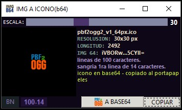
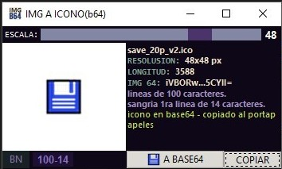

# Imagen a icono en base 64
programa realizado con python 3.10 y tkinter para convertir una imagen a icono en base64 (formato de texto)

 

## Funciones
al arrastrar una imagen sobre la interfaz del programa muestra vista previa sobre fondo blanco o negro (para mejor visualizacion del icono) para asignar el tamaño deseado, ademas muestra el icono a una escala de 16px en el boton "A BASE64"

Con el slider o scrollbar se puede redimensionar desde 12 a 60 pixeles y muestra el resultado en el visor del costado.

Una vez que conviertes **A BASE64** el programa te proporciona la siguiente informacion:
 * nombre del icono
 * resolucion del icono (la medida lo toma del valor del slider o scrollbar)
 * la longitud de caracter total del icono convertido a base64
 * vista previa del texto con los 6 primeros y 6 ultimos caracteres del icono a base64

 Los siguientes son mas de caracter estetico para el pasarlo al codigo:
 * cantidad de caracteres por linea, para que no se muestre en una sola linea (justificado)
 * sangria o tabulado de la primera linea (para que el texto se muestre justificado, incluso al momento de asignarlo a una variable)

> [!NOTE]
> al momento de convertir a base 64 el texto resultante se copia al portapapeles o clipboard, pero todo el texto esta en una sola linea

Con el boton **BN** cambia el color de fondo del visor del icono de negro a blanco y viceversa.
con los numero que estan al lado del boton **BN** se puede asignar el limite de caracter por linea y la sangria o tabulacion de la primera linea (para que al momento de presionar **COPIAR**) el texto ya este formateado

**LIBRERIAS**
- -